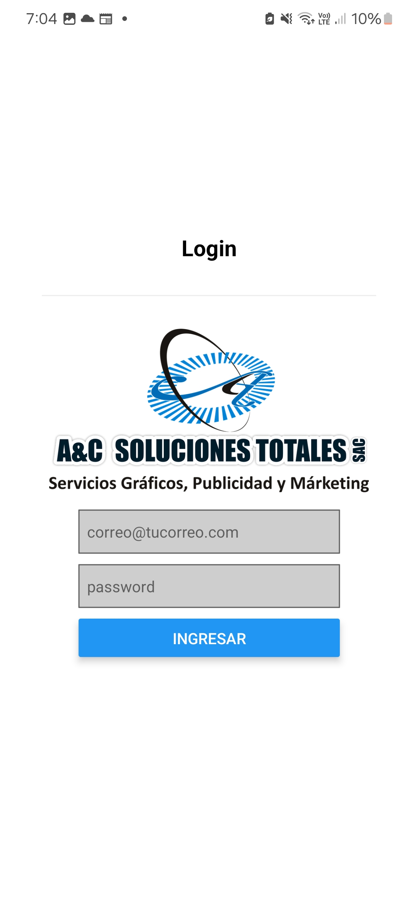

# App de Control de Compras con Factura

Solucion de Negocio sobre control de Compras con Factura en la Empresa. Poder cargar en un repositorio de Drive los pdf emitidos y compartidos de forma automatica.

## Interfaces

### 01 - Login

Validacion OAuth

  
  

### 02 - Dashboard - Graficos

Graficos  Generales sobre Cantidades, montos y estados de declaracion 

  
  

### 03 - Lista de Facturas

Visualizacion de detalles

  

### 04 - Registro

Interfaz de Registro de nueva Factura, opcion de escanear el codigo QR de la factura y el autocompletado 

  
  

### 05 - Icon App

Logo de la aplicacion

  

